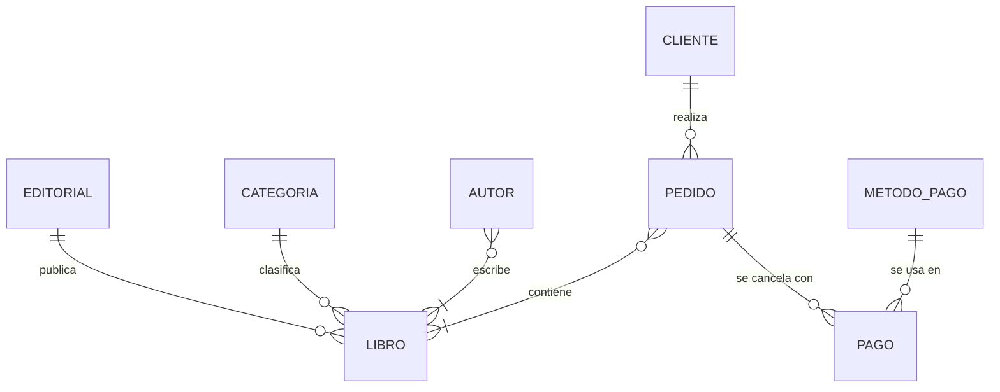

# Parte 2 · Diagrama Conceptual Entidad-Relación

El diagrama conceptual muestra **qué entidades existen y cómo se relacionan**, sin detalles de implementación (sin claves foráneas ni tablas intermedias). Por eso las relaciones muchos a muchos aparecen directas; en la Parte 3 se resuelven.

> Los diagramas están escritos en **Mermaid**, que GitHub y GitLab renderizan automáticamente al abrir este archivo.

**Notación:** `||` = uno y solo uno · `o{` = cero o muchos · `|{` = uno o muchos · `o|` = cero o uno.

## Relaciones, cardinalidades y justificación

| Relación | Cardinalidad | Lectura | Justificación |
|---|---|---|---|
| EDITORIAL – LIBRO | 1 : N | Una editorial publica 0..N libros; un libro es publicado por exactamente 1 editorial | Un ISBN pertenece a una sola editorial. Puede existir una editorial sin libros en catálogo. |
| CATEGORIA – LIBRO | 1 : N | Una categoría clasifica 0..N libros; un libro tiene exactamente 1 categoría | Simplifica la búsqueda. Si en el futuro un libro necesita varias categorías, pasaría a N:M. |
| AUTOR – LIBRO | N : M | Un autor escribe 1..N libros; un libro tiene 1..N autores | Coautorías reales. Todo libro debe tener al menos un autor. |
| CLIENTE – PEDIDO | 1 : N | Un cliente realiza 0..N pedidos; un pedido es de exactamente 1 cliente | Un cliente puede registrarse sin haber comprado aún. |
| PEDIDO – LIBRO | N : M | Un pedido contiene 1..N libros; un libro está en 0..N pedidos | Con atributos propios de la relación: `cantidad` y `precio_unitario`. |
| PEDIDO – PAGO | 1 : N | Un pedido se cancela con 0..N pagos; un pago corresponde a exactamente 1 pedido | 0 mientras el pedido está pendiente; N permite pagos parciales o reintentos. |
| METODO_PAGO – PAGO | 1 : N | Un método se usa en 0..N pagos; un pago usa exactamente 1 método | Catálogo reutilizable (Tarjeta Crédito, PayPal…). |

## Restricciones del modelo

1. `CLIENTE.correo` es **único** y no nulo.
2. `LIBRO.isbn` es la clave natural del libro; `precio ≥ 0` y `stock ≥ 0`.
3. `EDITORIAL.nombre`, `CATEGORIA.nombre` y `METODO_PAGO.nombre` son **únicos**.
4. Un pedido debe tener **al menos una línea** de detalle.
5. `cantidad > 0` en cada línea de pedido; no se puede repetir el mismo libro dos veces en un mismo pedido (se suma la cantidad).
6. `precio_unitario` guarda el precio **al momento de la compra**, independiente del precio actual del catálogo.
7. El total de un pedido **no se almacena**: se calcula como `SUM(cantidad × precio_unitario)`.
8. `PAGO.monto > 0`.

## Decisiones de diseño importantes

| Decisión | Motivo |
|---|---|
| Autor como entidad separada y relación N:M | Coautorías y reutilización de datos del autor. |
| `precio_unitario` en el detalle | Historial fiel: cambiar el precio hoy no altera facturas pasadas. |
| Pago como entidad separada del pedido | El enunciado distingue pedidos de transacciones; permite pagos parciales y varios métodos. |
| Sin total almacenado en el pedido | Evita datos derivados que se desincronicen. |
| Claves sustitutas (`id_*`) salvo en `LIBRO` | El ISBN es un identificador estándar y estable; el correo puede cambiar, así que no se usa como PK. |
