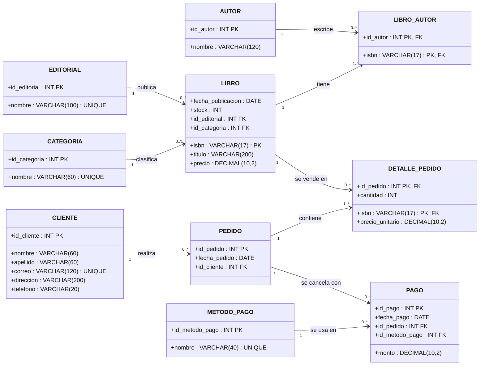
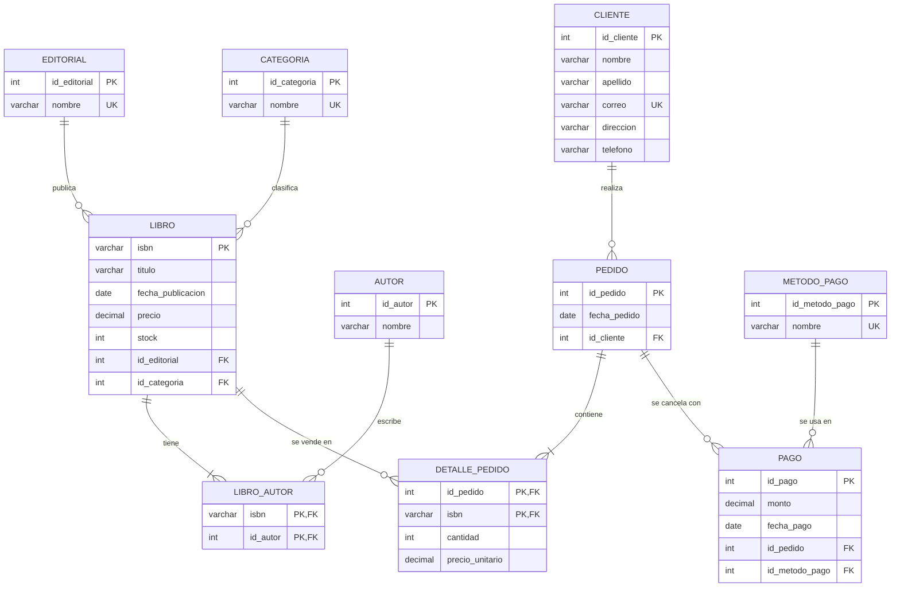

# Parte 3 · Diagrama UML Entidad-Relación

Estructura final de la base de datos, derivada del diagrama conceptual. Aquí ya aparecen:

- las **tablas intermedias** que resuelven las relaciones N:M (`LIBRO_AUTOR` y `DETALLE_PEDIDO`),
- todos los **atributos con tipo de dato**,
- las **claves primarias (PK)** y **foráneas (FK)**,
- las **cardinalidades** en ambos extremos.

## 3.1 Diagrama de clases UML

## 3.2 Vista E-R con claves (notación pata de gallo)

## 3.3 Claves foráneas y reglas de integridad referencial

| FK | Referencia | ON DELETE | Motivo |
|---|---|---|---|
| `LIBRO.id_editorial` | `EDITORIAL.id_editorial` | RESTRICT | No borrar una editorial con libros. |
| `LIBRO.id_categoria` | `CATEGORIA.id_categoria` | RESTRICT | No borrar una categoría en uso. |
| `LIBRO_AUTOR.isbn` | `LIBRO.isbn` | CASCADE | Si se borra el libro, se borran sus vínculos con autores. |
| `LIBRO_AUTOR.id_autor` | `AUTOR.id_autor` | RESTRICT | No borrar un autor con libros. |
| `PEDIDO.id_cliente` | `CLIENTE.id_cliente` | RESTRICT | Conservar el historial de ventas. |
| `DETALLE_PEDIDO.id_pedido` | `PEDIDO.id_pedido` | CASCADE | Las líneas no existen sin su pedido. |
| `DETALLE_PEDIDO.isbn` | `LIBRO.isbn` | RESTRICT | No borrar un libro que ya fue vendido. |
| `PAGO.id_pedido` | `PEDIDO.id_pedido` | RESTRICT | Los pagos son registro contable; no se borran en cascada. |
| `PAGO.id_metodo_pago` | `METODO_PAGO.id_metodo_pago` | RESTRICT | Conservar la trazabilidad del método usado. |
